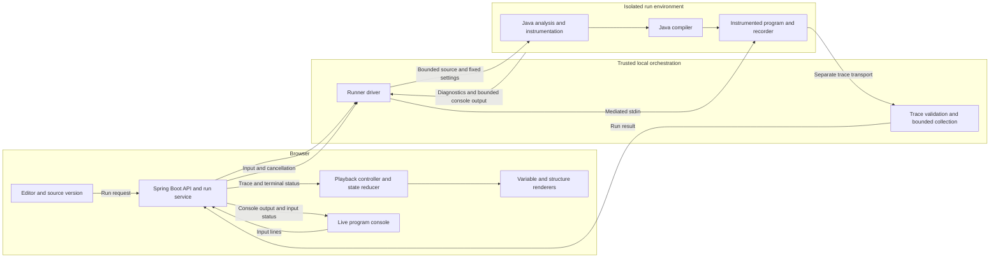

# Java Code Visualization Architecture

2026-10-04 design review: [composable Java tracing](composable-java-tracing.md) proposes recursive capability analysis and composed statement/expression lowering, with algorithms as acceptance programs rather than eligibility templates. [ADR 0011](decisions/0011-composable-java-tracing.md) preserves existing module boundaries and legacy evidence while pausing the sorting-specific draft-5 sequence. This is an implementation-direction proposal, not evidence of general Java tracing or authorization to build it.

## 1. Purpose and status

This document describes the intended application design. It is not an agent definition or evidence of implemented functionality. The source of product intent is [PROJECT_REQUIREMENTS.md](../requirements/PROJECT_REQUIREMENTS.md); repository working rules are in [AGENTS.md](../AGENTS.md).

Status: intended application architecture with a bounded Milestone 1 runner/trace prototype. Confirmed product decisions below are requirements; detailed unimplemented choices remain proposals. The composable tracing direction was adopted through merged PR #11, but its new analyzer/runtime path is not implemented. Consult [current state](../memory/current-state.md) for the active task and verified scope; open specification work does not mean restarting repository setup.

The product helps Java beginners and algorithm students understand execution through synchronized code and diagrams. V1 runs locally on Windows. Correct variables and arrays come first, followed by collections and tree/heap sorting. There is no fixed deadline.

| Area | Status | Direction |
| --- | --- | --- |
| Frontend stack | Confirmed | TypeScript, React, Vite, TanStack Query, Axios, and TanStack Router |
| Backend stack | Confirmed | Java 21, Spring Boot, and Maven |
| Frontend version baseline | Selected | Node.js 22 (local 22.23.2 verified), React/React DOM 19.3, Vite 8; exact dependency patches and install validation pending |
| Local execution environment | Confirmed | Docker Desktop with WSL2 and Linux runner containers |
| Java scope | Confirmed | Ordinary single-file Java under execution restrictions; incremental tracing coverage and explicit output-only fallback; methods/recursion visualization remain required in V1 |
| Manual playback | Confirmed | One observable operation per Step click, with source-expression highlighting |
| Diagram interaction | Confirmed | Drag existing boxes/nodes for readability; code determines values and connections |
| Live console | Confirmed | Incremental stdout/stderr and line input to supported `Scanner` reads during Run; diagram playback after termination |
| Full V1 structures | Confirmed | Variables, arrays, lists, stacks, queues, maps, binary-search-tree sort, and heap sort |
| Editor and playback implementation | Proposed | Monaco Editor, deterministic state reducer, renderer registry |
| Trace engine | Bounded prototypes verified; composable path pending | Java-aware analysis and source instrumentation; construct-based expansion under ADR 0011 |
| Parser/resolver | Narrow analysis and transformation verified | JavaParser + JavaSymbolSolver 3.28.2; Java 21, bounded array analysis/automatic recording and Docker tests under [ADR 0005](decisions/0005-javaparser-prototype-candidate.md); broader coverage pending |
| Recorded playback behavior | Confirmed | Playback after run termination using available validated traces, including partial results |
| Trace delivery implementation | Bounded prototype verified | Private FIFO transport, bounded collection and draft-1 through draft-4; production delivery, new lifetime/grouping semantics and API integration remain unfinished |
| Toolchain and wire formats | Partially established | Java/Maven/parser prototype pins and draft-1 through draft-4 exist; application dependencies and future contracts need separate setup/specification |

Accounts, databases, cloud persistence, collaboration, AI explanations, arbitrary dependencies, and public deployment are outside initial implementation scope. Trace recording does not require a distributed event-sourcing platform.

### Confirmed stack responsibilities

The user confirmed the frontend and backend stack on 2026-09-15. Vite provides frontend development/build tooling. Axios provides HTTP transport through a shared API client. TanStack Query manages server request state and caching for run submission, status, results, and cancellation; TanStack Router manages navigation. React/TypeScript components consume these boundaries without embedding transport logic in renderers.

Execution playback state remains separate from server state: the proposed reducer owns the playback cursor, frames, variables, and objects reconstructed from recorded events. Query caching must not become the mechanism for advancing execution steps.

Maven is the selected backend build system. The Docker worker boundary remains unchanged. Java 21 and the frontend version lines below are selected. Exact dependency patches, frontend package manager, styling, diagram-rendering tools, and testing tools remain unresolved. Documentation compatibility checks have been performed; dependency installation and integration testing have not.

### Version baseline and compatibility evidence

Checked on 2026-09-15 under the user's approval to select suitable versions without installation:

| Component | Baseline | Evidence and remaining validation |
| --- | --- | --- |
| Node.js | 22; retain local 22.23.2 | `node --version` returned `v22.23.2`. It meets Vite's documented Node 22.12+ minimum; plugin/template requirements still need checking during setup |
| React and React DOM | Matching 19.3 patch versions | Official React versions page lists 19.3 as current; exact matching patches and peer dependencies will be pinned during setup |
| Vite | 8.x | Official Vite 8 release and getting-started documentation support this version line and Node baseline; select a compatible React plugin during setup |
| Java | JDK 21 for backend and runner | Explicit user requirement; set compiler release target 21 and retain the documented Java subset. Installed JDK and container image have not been checked |
| Spring Boot | 4.1.x candidate | Official 4.1.1 requirements cover Java 17 through 26, including 21. Final patch/dependency selection remains setup work |
| Maven | 3.9.16, project-local analyzer setup verified | Checksum-verified bootstrap in runner/analysis; no Spring Boot application build exists yet |

Sources: [React versions](https://react.dev/versions), [Vite 8 release](https://vite.dev/blog/announcing-vite8), [Vite Node requirements](https://vite.dev/guide/), and [Spring Boot system requirements](https://docs.spring.io/spring-boot/system-requirements.html).

These checks establish documented compatibility boundaries, not a verified application build. Recheck exact TanStack Query/Router, Axios, TypeScript, and Vite plugin peer dependencies when creating the lockfile. No packages or runtimes were installed or upgraded during this review.

## 2. System boundaries

Use one repository and a modular application with an isolated execution worker. Repository modules are responsibility boundaries; they are not a requirement to deploy independent services.

The proposed placement of analysis and instrumentation inside the worker is a refinement of the requirements' pipeline. The backend orchestrates semantic validation; the worker performs it under resource limits. This bounds expensive source processing along with compilation. Prototype findings may change this placement without changing frontend contracts. Compiler and runtime execution must always remain outside the backend JVM.

### Module ownership

| Module | Responsibilities | Boundary rules |
| --- | --- | --- |
| `frontend/` | Editor, source snapshots, run controls, diagnostics, playback reducer, structure renderers | Does not interpret Java or infer runtime values |
| `backend/` | Request validation, run identity, lifecycle, admission limits, runner coordination, result delivery | Does not compile or execute submitted programs |
| `runner/` | Driver contract and implementation, worker entry point, source analysis, instrumentation, compilation, recording, structure adapters | Keep trusted driver code separate from code shipped into the submitted program's environment |
| `contracts/` | Versioned API/trace schemas and representative fixtures | Contains runtime facts and protocol definitions, not UI implementation |

The runner driver may initially be a library loaded by the backend. Worker code runs separately in Docker. This distinction prevents a repository directory from being mistaken for a security boundary.

## 3. Run lifecycle and delivery

Proposed lifecycle: accepted, validating, compiling, executing, then completed, failed, cancelled, or limited. Execution may wait for standard input and resume after it arrives. Represent that waiting condition explicitly; exact detection and status transitions remain to be specified. A request rejected before admission returns diagnostics without claiming a successful run. UI states such as empty/loading are separate from execution status.

1. The frontend captures immutable source text and associates the request with that editor version.
2. The backend validates request shape and size, assigns run identity and a source hash, and checks capacity.
3. The trusted driver creates an isolated environment using fixed worker configuration. Submitted source cannot select host paths, container arguments, compiler plugins, or runtime commands.
4. The worker separates execution-policy admission from tracing eligibility. It instruments eligible source, or selects original-source output-only execution for tracing limitations with an explicit diagnostic under ADR 0002. Admission and entry-point checks still apply.
5. The compiler checks instrumented source on the tracing path or original source on the output-only path. Map generated diagnostics back to original source only when reliable; preserve transformation-failure provenance rather than blaming valid Java.
6. Execution produces ordered trace records and separately bounded stdout/stderr. The collector validates and retains complete records as they arrive.
7. The driver determines the terminal outcome, terminates remaining processes, and cleans run resources. Available validated trace records become the result even when execution fails or hits a limit.
8. The frontend loads the trace for playback against its original source snapshot. Editing current source must clearly invalidate the displayed trace or preserve a separate read-only snapshot.

The first noninteractive tracing prototype can return a bounded result directly. The end-to-end V1 API must create a run handle, deliver console output incrementally, accept input, expose input-wait status, support cancellation, and retrieve the terminal result. Recorded diagram playback remains separate and begins after termination. Console transport is confirmed in [ADR 0001](decisions/0001-live-console-websocket.md): native browser WebSocket with Spring WebSocket handlers for console output/input/EOF and notifications; Axios/TanStack Query over HTTP for run creation, cancellation, status, and completed results. Exact routes, payloads, result retention, and capacity responses belong in the API contract before implementation. This requirement does not introduce live diagram playback, a broker, or durable jobs.

### Live console and standard input

The frontend console displays output chunks during execution, including a prompt without a newline. Pressing Enter submits a line to the active run. The backend validates identity, state, and input bounds; the trusted driver writes accepted data to that worker's standard input. Submitted code needs no network connection. The console provides program I/O, not arbitrary shell commands.

Instrument or otherwise observe supported input reads to distinguish waiting from computation without guessing from prompt text. A `Scanner` can buffer tokens, so entering one line does not necessarily correspond to exactly one Java read. Specify token/line semantics and wait detection in the Java support and trace contracts, and validate them against real Java behavior.

Record input consumption and resulting execution facts sufficiently for deterministic playback. Console submissions and consumed values are distinct facts; do not claim a submitted line was consumed before a successful read. Define transcript ordering, encoding, EOF, invalid-input exceptions, and stdout/stderr attribution. Replaying a recorded run never resubmits stdin.

Do not automatically retry input writes in a way that can duplicate entered data. Specify acknowledgement/deduplication or explicit failure behavior, as well as disconnect handling. The user confirmed WebSocket on 2026-09-16. Keep its connection manager separate from editor and playback state; reconcile notifications with authoritative HTTP run status. Define bounded queues, serialized server sends, initial attachment/catch-up, and reconnect policy before implementation. This choice does not select worker trace transport or permit submitted-code network access.

Keep the trusted run service authoritative for cancellation and enforced limits. Specify precedence for completion/cancellation races and make repeated cancellation safe. A crashed worker, invalid trace, or collection failure must never appear as completed execution.

A proposed local default is one active run with a bounded in-memory result store. Exact capacities and expiration rules remain to be specified. Backend restart may discard local results; orphan cleanup must still be designed and tested.

## 4. Java analysis and instrumentation

The approved [array analysis prototype](array-analysis-experiment.md) now establishes an in-process original-source handoff in runner/analysis. It is separate from the existing execution harness and manual recorder. Its bounded Docker test worker does not establish full backend integration, general Java analysis, or automatic transformation.

Follow-up, 2026-09-23: a separate instrumentation package now consumes that handoff and modifies a syntax-only AST copy for the [automatic array recording experiment](automatic-array-recording.md). This narrow transformation and its isolated runtime comparisons are verified; general Java transformation and backend integration remain unfinished.

Start with a documented single-file entry convention such as `Main.main`. Evaluate a Java-aware parser and symbol resolver during the prototype. A parser identifies syntax; execution supplies runtime values. Editor-side analysis is advisory and cannot replace worker validation.

Separate these responsibilities within the engine:

- Support policy: accepted syntax, types, methods, templates, and explicit rejections.
- Analysis: resolved symbols, expression types, scopes, and original source ranges.
- Transformation: instrumentation that preserves evaluation order, short-circuiting, side effects, exceptions, and return values.
- Recording: stable identities, typed values, ordered events, and bounded serialization.
- Structure adapters: logical state and operations for specifically supported resolved types or conventions.

Never evaluate an expression twice for tracing. For `values[i++] = calculate()`, any supported transformation must preserve the increment, call, exception order, and assignment behavior. Reject unsafe transformations, not ordinary execution solely because tracing is unsupported. Follow [ADR 0002](decisions/0002-java-execution-and-visualization-coverage.md): compile/run original admitted source in isolation when the output-only path is selected before execution. Do not silently rerun after execution has started. Represent execution outcome separately from complete, partial, or unavailable visualization; exact status fields remain contract work.

Methods and recursion require distinct call frames, parameter bindings, return values, and scope lifetimes. Model those identities in the contract early even if the first prototype only executes `main`. Specify depth limits and exception unwinding before implementing recursive algorithms.

Source instrumentation remains provisional until semantic comparison tests pass. If it fails the feasibility gate, investigate JDI or a documented-subset interpreter through the same engine interface. Do not build multiple complete engines in parallel.

## 5. Trace contract and playback state

The trace is the boundary between Java execution and presentation. Final field definitions belong in `contracts/` with semantics in the planned `specs/trace-format.md`.

The contract must carry schema version, run/source identity, event order, original source ranges, typed values, object/variable/scope/frame identities, diagnostics, terminal outcome, and explicit truncation or limit information.

Proposed state model:

- Variables map stable variable identities to declared type, display name, scope/frame identity, and value.
- Objects map stable object identities to logical structure state. Aliased variables reference one object record.
- Frames and scopes describe active bindings and lifetimes. Exiting a scope does not delete objects still referenced elsewhere.
- The playback cursor identifies an observable operation boundary and its corresponding trace position.
- Highlight state records the current operation's source and affected values or structure elements independently from persistent program state.

Numeric serialization must preserve supported Java values, including large `long` values and floating-point special values. Do not silently coerce them into inaccurate JavaScript numbers. The exact tagged representation remains a schema decision.

Proposed event semantics: successful mutations describe committed state after the operation. Failed operations produce diagnostics/exception events without a false successful mutation. Comparisons record operands and result in execution order. A swap may span multiple assignments.

Some trace records manage identities or scopes rather than represent a user-visible operation. Specify which records belong to each observable boundary so Step never pauses on unexplained bookkeeping or skips a user operation. Method entry/exit and unwinding need explicit treatment in this mapping.

The reducer reconstructs state from an initial state and ordered records. Backward stepping replays a prefix, optionally from periodic snapshots; it does not reverse Java execution. Snapshots are an optimization and must yield the same state as replay from the beginning.

Unknown incompatible schema versions, invalid references, and corrupt event sequences produce explicit errors. Do not silently skip events that could affect correctness. Performance limits must bound accepted traces so seeking and rendering remain practical; measure before adding snapshot complexity.

## 6. Visualization design

The confirmed interface and reference-image interpretation are documented in [frontend-design.md](frontend-design.md). Use dark-only styling with visualization left, Java editor upper right, and live console lower right. Display only supported structures from the submitted program existing at the selected recorded step. The screenshot guides layout/style, not algorithm-specific calculation diagrams.

Arrays move as groups. Individual list/tree/heap nodes may be repositioned while preserving logical order, values, references, and heap index mappings. Heap array/tree views remain synchronized. Define presentation identities for value elements separately from runtime object identity so repeated values do not cause layout collisions. Panel resizing, pan/zoom, and layout reset remain proposed conveniences.

Renderers consume logical state and operation highlights, never Java source text to guess algorithm behavior. A registry chooses a renderer for a supported structure kind. Layout and animation settings remain frontend concerns.

| Structure | Required presentation |
| --- | --- |
| Variable | Name, type, current value, assignment highlight, and lifetime |
| Array | Indexed values, length, access/write highlights, and shared references |
| List | Ordered values and supported reads/additions/replacements/removals |
| Stack | Vertical values, top marker, push/pop/peek, and empty state |
| Queue | Front/back markers, enqueue/dequeue/peek, and empty state |
| Map | Key/value entries with documented ordering and supported updates/lookups/removals |
| Binary search tree | Recorded construction, links, comparisons, and traversal for tree sort |
| Heap | Synchronized array/tree views of user-written heap sort, including comparisons, swaps, sift operations, active heap boundary, and sorted suffix |

Use explicit display selection or a documented convention for ambiguous `Deque` usage. Use an agreed node template for tree sort. Define how heap-array identity and active heap size are captured; do not infer them from variable names or priority-queue iteration.

Handle empty structures, nulls, duplicate values, aliases, and cycles without duplicating object identity or traversing indefinitely. Tree-sort duplicate handling must be specified so sorting preserves input multiplicity.

One manual Step applies one observable operation and synchronizes code and diagram state. Playback speed changes timing, not event order. Serializing or finishing an ongoing animation before another step is a proposed UI policy; the final policy must prevent the display from diverging from the cursor.

Dragging moves existing diagram elements for readability only. Store positions in separate frontend layout state keyed by stable element identities; connected lines follow those positions. The trace remains free of coordinates. Moving elements must not mutate program values, links, identities, or the playback cursor. Creating structures, drawing new program links, and editing data through diagrams are outside this interaction scope. Define layout behavior across backward steps, disappearing/reappearing objects, restart, and new runs in the visualization specification.

## 7. Execution isolation and resource ownership

The browser, API input, submitted source, stdout/stderr, and worker-produced data cross validation boundaries. Docker management belongs only to trusted orchestration. Submitted code must never receive a management socket, application secrets, or host mounts.

Proposed worker configuration uses an unprivileged identity, no network access, restricted writable temporary storage, and minimal runtime privileges. Enforce compilation/execution timeout, memory, process/thread count, output bytes, trace bytes/events, collection size, traversal depth, and recursion depth. Exact settings and enforcement mechanisms remain prototype work.

Bounds apply to source analysis and trace validation as well as program execution. Unsupported-feature validation is not a sandbox. Container availability does not prove isolation.

Bound input line size, aggregate bytes, queued input, and waiting time. Specify whether input waiting pauses the computation timeout, with an overall run bound that still guarantees cleanup. Cancellation must work while stdin is blocked. Define EOF, browser disconnect, late input after termination, and orphan recovery; do not leave workers waiting indefinitely. Keep input/console transport separate from the trusted trace channel.

The trace transport must be distinct from stdout/stderr and support incremental collection into trusted bounded storage. Its concrete mechanism is unresolved. A final trace written only at normal exit is insufficient because timeout or forced termination can prevent that write. Validate complete records, retain the last valid prefix, and label incomplete data explicitly.

Separating stdout from tracing prevents printed text from being mistaken for events; it does not by itself prevent deliberate tampering with an in-process recorder. Restrict access to tracing internals through the supported-source policy and validate records outside the worker. Public hostile-code readiness requires additional assessment.

The driver owns container termination, cleanup, and recovery of orphaned runs. The run service owns retained results and their expiration. Cleanup must execute after success, failure, cancellation, limits, and interrupted orchestration. Specify crash recovery before claiming reliable local operation.

Docker Desktop/WSL2 prerequisites and pinned images/toolchain versions will be verified during setup. No installation or isolation verification is claimed by this document.

## 8. Extension paths and trade-offs

### Adding a list

Define supported resolved types and operations in the support matrix. Add or extend a runtime adapter, logical events/state handling, and a list renderer. Add contract fixtures and semantic/replay tests. The editor, run lifecycle, and Docker driver should remain unchanged unless the new feature introduces a concrete requirement there.

Adapters alone may not capture previously unsupported calls. Add narrow instrumentation support when necessary rather than hiding it inside rendering code.

### Expanding Java support

Add syntax/semantic support in analysis and transformation, with original-versus-instrumented execution tests. Reuse trace and rendering contracts where existing facts suffice; version incompatible changes deliberately. Multiple source files would also require request/source mapping changes. Broader support is incremental and does not imply arbitrary Java compatibility.

### Moving to a server

Keep host paths, container management, capacities, and deployment settings behind runner/configuration boundaries. A later deployment can reuse engine contracts and frontend playback while adding verified multi-user isolation, access controls, admission control, and operational recovery. Windows-local V1 does not establish server readiness.

### Decision rationale

| Proposed choice | Benefit | Cost or validation needed |
| --- | --- | --- |
| Modular application with isolated worker | Clear ownership with limited operational complexity | Worker lifecycle still requires careful orchestration |
| Recorded trace playback | Deterministic seeking and independent UI development | Bounded memory/storage and delay before playback |
| Source instrumentation | Direct connection between source operations and events | Substantial semantic-preservation and source-mapping work |
| Explicit structure conventions | Predictable detection and truthful diagrams | Users must follow templates until support expands |
| Shared versioned contracts | Engine/UI evolution with testable compatibility | Producer and consumer changes require coordination |

Record accepted material decisions with alternatives and consequences in `specs/decisions/` as they are resolved. Avoid adopting databases, caching, CQRS, or distributed services solely because an architecture checklist lists them.

## 9. Delivery gates and unresolved specifications

| Milestone | Architecture proof |
| --- | --- |
| 0: Specifications | Define Java support, candidate contracts, isolation policy, acceptance programs, and setup decisions; architecture alone is insufficient |
| 1: Trace prototype | Correct scalars, arrays, loops, comparisons, bubble sort, aliasing, side effects, failures, and enforced limits |
| 2: End-to-end playback | Editor/API/worker integration; exact intermediate states, backward steps, source identity, live console and Scanner input, draggable layouts, and one-operation stepping after termination |
| Before milestone 4 | Verified methods and recursion, including parameters, returns, frame lifetimes, unwinding, and depth limits |
| 3: Collections | Supported list/stack/queue/map operations and renderers with acceptance coverage |
| 4: Tree/heap sorting | Binary-search-tree sort and heap sort with recorded internal operations and correct representations |
| 5: Full V1 | Entire documented support matrix, cleanup/isolation checks, browser checks, and reproducible development instructions |

Use requirements acceptance cases AC-01 through AC-23 as the baseline. Compare original and instrumented execution for output, values, exceptions, and side-effect counts. Check expected intermediate replay states, not only sorted output. Add meaningful worker-limit tests and a browser sorting flow when those components exist. Before console UI integration, prove prompt delivery, a supported Scanner read, input waiting/resume, EOF, and cancellation in the worker. Verify dragging preserves recorded state, only relevant structures appear, array/node dragging follows the frontend specification, and replay never requests input again.

The following are planned specification destinations, not existing completed artifacts:

| Destination | Decisions to resolve |
| --- | --- |
| `specs/v1-scope.md` | Full V1 support boundaries and milestone mapping |
| `specs/java-support.md` | Primitive types, syntax, library calls, method/recursion rules, templates, and exclusions |
| `specs/trace-format.md` and `contracts/` | Typed values, event/step mapping, frame lifetimes, source ranges, protocol versions, and run API |
| `specs/visualization-rules.md` | Tree duplicates, stack/queue modes, heap size capture, animation/stepping behavior |
| `specs/execution-isolation.md` | Transport, limits, container policy, capacity, cancellation races, cleanup, and crash recovery |
| `specs/acceptance-cases.md` | Runnable programs, expected intermediate states, failure results, and pass criteria |
| `specs/decisions/` | Validated parser/engine choices, delivery decisions, and pinned toolchain rationale |
| `memory/` | Verified progress, immediate next steps, and known limitations |

The next recommended work is the variable/array Java support matrix and candidate trace contract with a small set of representative programs. Follow the repository's discussion and confirmation rule before starting that work.
